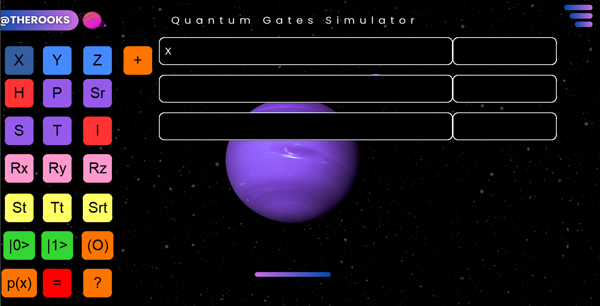
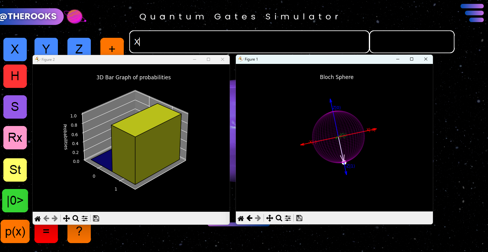
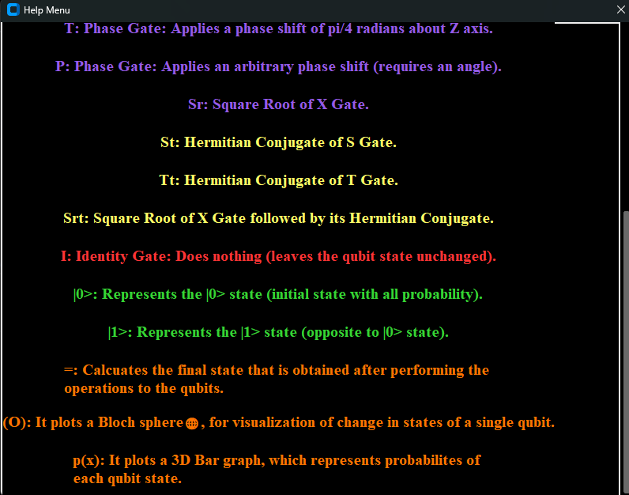

# Quantum Circuit Simulator

A lightweight yet powerful **quantum circuit simulator** built using Python's Tkinter library. Create, manipulate, and visualize quantum circuits interactively — no quantum computer needed (yet 😉).

## 🚀 Table of Contents
- [Features](#features)
- [Installation](#installation)
- [Usage](#usage)
- [Screenshots](#screenshots)
- [Requirements](#requirements)
- [Contributors](#contributors)
- [License](#license)

## ✨ Features
- 🧱 **Build Quantum Circuits** using various gates: X, Y, Z, H, Rx, Ry, Rz, and more
- 🎯 **Precise Control**: Input custom angles for rotation gates
- 🧠 **Multi-Qubit Support**: Build circuits with multiple qubits
- 🌐 **Bloch Sphere Visualization**: See the quantum states evolve live
- 📊 **3D Probability Graphs**: Visualize state probabilities beautifully
- 📚 **Built-In Help Menu**: Quick explanations of all available gates

## 🛠️ Installation

1. Clone this repository:
   ```bash
   git clone https://github.com/Sri-Ram-A/quantumsim.git
   ```
2. Navigate to the `gui` directory:
   ```bash
   cd path\to\your\project\gui
   ```
3. Install required packages:
   ```bash
   pip install -r requirements.txt
   ```

## 🎮 Usage

1. Navigate to the `gui` folder:
   ```bash
   cd path\to\your\project\gui
   ```
2. Launch the application:
   ```bash
   python app.py
   ```
3. Start building quantum circuits!
   - Drag and drop gates onto your qubits
   - Enter rotation angles where needed
   - Visualize states on the Bloch sphere or see their probability distributions
   - Use the Help menu if you forget what a gate does

## 🖼️ Screenshots

| Intro Screen | Building Circuits | Help Menu |
|:------------:|:-----------------:|:---------:|
|  |  |  |

## 📦 Requirements

Make sure you have the following Python packages installed:
- `numpy`
- `matplotlib`
- `Pillow`
- `customtkinter`

All dependencies are listed in `requirements.txt`.

Install everything easily:
```bash
pip install -r requirements.txt
```

## 👨‍💻 Contributors

Thanks to these awesome folks for making this happen:

- [Shashank K](https://github.com/00xshashank)
- [SriRam A](https://github.com/Sri-Ram-A)
- [Shishir V](https://github.com/ShishirV712)

> Want to contribute? Fork the repo, build something cool, and send us a pull request!
